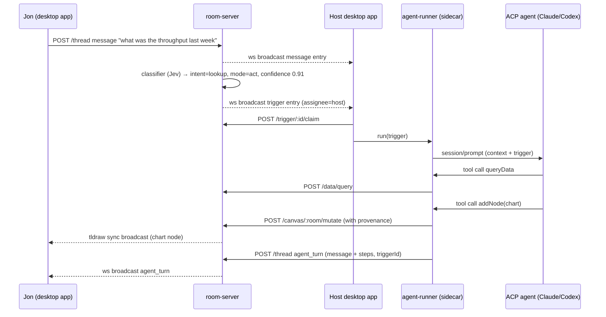

# Canvas assistant: backend architecture and implementation guide

Author: Asier · Status: Drafting · Last update: 2026-09-19

We are building a realtime collaborative infinite canvas with a shared thread and a live call, where an AI assistant follows the conversation and keeps the canvas up to date with rich nodes (charts, tables, decisions). The desktop shell (Tauri) already runs. This document covers everything behind it: the room server, the thread log, the trigger layer, and the agent runner, plus the contracts the desktop app needs to talk to them.

The call runs on **Vonage Video**. For the first version the call is audio and video only: people talk, the canvas and the thread stay in sync, and the assistant is driven by typed messages and canvas edits. Transcription, and with it the assistant reacting to speech, is deferred to [Later additions](#later-additions-voice). The trigger layer is designed so that turning speech back on is adding one entry source, not reworking the pipeline.

## Two ideas that shape everything

**The thread is the record and the canvas is the result.** The thread is an append-only log of everything that happened in the room: what people said (transcript), what they typed, what the system decided, and what the assistant did. Nobody edits it. The canvas is the current state of the discussion, editable by anyone, and every node points back to the thread entries that produced it. When we are unsure where something belongs, this rule decides: if it happened, it goes in the thread. If it is true now, it lives on the canvas.

**AI is a local concern, shared state is a server concern.** This is the model Zed uses. The frontier agent (Claude, Codex, Gemini) runs as a subprocess on the host's machine under the host's own subscription, and we talk to it through the **Agent Client Protocol (ACP)**, the open JSON-RPC protocol Zed and JetBrains use to drive external agents. The server never holds a model token. It syncs the canvas and the thread, decides _when_ the agent should act, and records what the agent did. The agent's edits reach everyone as ordinary sync operations tagged with provenance.

The one thing the server does decide is the trigger. The classifier lives on the server because it needs the full room state, and its decisions are thread entries, so everyone can see why the assistant woke up.

## Design principles

- One log, one place to look. Chat, transcript, triggers, and agent activity are entry kinds in the same thread, and the UI filters them.
- The agent acts when addressed and proposes otherwise. Proactive captures land as suggestion cards a human accepts.
- The executor is dumb. The server produces a trigger entry that says why and what, and the agent runner only executes.
- Every agent mutation carries provenance back to the thread entry that caused it.
- Swappable agents. Any ACP agent drives the canvas through the same MCP tools, so changing Claude for Codex is a config line.
- One process per concern, all plain Node, all deployable on a single Fly.io machine.

## Components

- **Room server** (`apps/room-server`): Hono + `ws`. Hosts one tldraw `TLSocketRoom` per room, the thread log, the classifier, and the HTTP routes for tokens and data. SQLite for storage.
- **Agent runner** (`apps/agent-runner`): the ACP client. Spawns the agent, hands it the canvas MCP server, builds prompts from trigger entries, streams results back into the thread and the canvas. Runs as a Tauri sidecar on the host's machine, and also on the server as a fallback executor with API keys.
- **Canvas MCP server** (inside `agent-runner`): exposes `getCanvas`, `addNode`, `updateNode`, `connectNodes`, `arrange`, and `queryData` to the agent. Each tool call becomes an HTTP call to the room server.
- **Desktop app** (`apps/desktop`, already running): Tauri shell with the web UI, connects to the two room WebSockets and to the Vonage session, spawns the sidecar.
- **Shared protocol** (`packages/protocol`): zod schemas for thread entries, node props, trigger entries, and tool inputs. Every other package derives its types from here.

## Execution flow

The happy path, from someone asking a question in the thread to a chart appearing on the board:



Every arrow into `room-server` is either a thread append or a canvas mutation. There is no third kind of write. When we add transcription later, it enters this diagram at exactly one point: a process posting `transcript` entries to `POST /thread`. Everything downstream is unchanged, which is the reason to cut voice first and add it last.

## Room server

The room server is the only stateful process and the only thing clients trust. It runs three things per room: the tldraw sync room, the thread log, and the classifier. Everything else (desktop app, agent runner, and later the transcription worker) is a client of it.

### Canvas sync

We use `@tldraw/sync-core` and create one `TLSocketRoom` per room, following tldraw's `simple-server-example`. Clients connect to `ws://host/sync/:roomId` with the standard tldraw sync client. Storage is `SQLiteSyncStorage` over `node:sqlite` through `NodeSqliteWrapper`, so boards survive a restart with no external database. `InMemorySyncStorage` is fine for the first evening.

Custom shapes (chart, table, markdown, decision, cluster label) live in `packages/nodes` and register on both the client editor and the server room, because the server validates records against the schema. If the two disagree, the sync layer rejects the record with `INVALID_RECORD`, so the package must be the single definition.

The server applies agent mutations itself through `room.updateStore()`, which is how they reach clients as normal sync operations. Clients never see a "special" agent write.

### Thread log

The thread is an append-only table in the same SQLite file. The server assigns a monotonic `seq` per room, broadcasts every append on `ws://host/thread/:roomId`, and answers `since=<seq>` on reconnect. That is the whole protocol.

```ts
type ThreadEntryBase = { id: string; roomId: string; seq: number; at: string };

type ThreadEntry = ThreadEntryBase &
  (
    | {
        kind: "message";
        authorId: string;
        text: string;
        anchors?: { shapeIds: string[] };
      }
    | {
        kind: "transcript";
        speakerId: string;
        text: string;
        startMs: number;
        endMs: number;
      }
    | { kind: "trigger"; trigger: Trigger }
    | {
        kind: "agent_turn";
        triggerId: string;
        agentId: string;
        byUserId: string;
        text: string;
        steps: AgentStep[];
        touchedShapeIds: string[];
        status: "running" | "done" | "failed";
      }
    | {
        kind: "suggestion";
        triggerId: string;
        quote: { entryId: string };
        draft: NodeDraft;
        status: "open" | "accepted" | "dismissed";
      }
    | { kind: "system"; text: string; shapeIds?: string[] }
  );

type AgentStep =
  | {
      type: "tool_call";
      tool: string;
      input: unknown;
      output?: unknown;
      shapeIds?: string[];
    }
  | { type: "thinking"; text: string };
```

Two rules keep the log honest. Human canvas edits also produce `system` entries ("asier moved 'Cold start' under OPEN QUESTIONS"), debounced per user to one entry per few seconds, so the agent's context includes what people rearranged. And `agent_turn` entries are the only entries the server updates in place (to stream text and steps), the server writes everything else once.

### HTTP routes

| Route                                       | Caller                     | Purpose                                                  |
| ------------------------------------------- | -------------------------- | -------------------------------------------------------- |
| `POST /rooms`                               | desktop                    | create a room, returns ids for sync, thread, and video   |
| `GET /rooms/:id/video-token`                | desktop                    | mint a Vonage session token for this participant         |
| `POST /rooms/:id/thread`                    | runner, desktop            | append an entry                                          |
| `PATCH /rooms/:id/thread/:entryId`          | runner                     | stream updates into an `agent_turn`                      |
| `POST /rooms/:id/triggers/:triggerId/claim` | desktop                    | claim a trigger for this executor                        |
| `POST /rooms/:id/canvas/mutate`             | runner (via MCP)           | apply a batch of shape operations with provenance        |
| `GET /rooms/:id/canvas/summary`             | runner (via MCP)           | compressed JSON view of the board                        |
| `POST /rooms/:id/data/query`                | runner (via MCP)           | run a question against a data source                     |

Auth for the hackathon is a shared room secret in a header. We are not building accounts.

## Trigger layer

The trigger layer decides whether the assistant feels like a colleague or like Clippy, and it is a backend concern because it needs the whole room state and its decisions have to be visible to everyone.

### Classifier

The classifier runs on the server on two inputs today: every human message, and every debounced canvas change. Transcript lines become a third input when voice lands, and they need no new code path because a transcript is just another thread append. It gets a state blob (last 60 seconds of transcript, last 10 thread entries, canvas summary, open suggestions) and answers a fixed set of typed questions.

We plan to use **Jev** from TypeSafe AI, a decision-only model that takes state plus typed questions and returns choices, scores, and yes/no probabilities with calibrated confidence in 70 to 500 ms, at $0.042 per million input tokens. It shipped in early access on 2026-09-15, so access is not guaranteed by Friday. The fallback is Haiku 4.5 with a JSON schema returning the same fields. Both sit behind one interface:

```ts
interface Classifier {
  decide(state: RoomState): Promise<Decision>;
}

type Decision = {
  addressed: { value: boolean; confidence: number };
  worthCapturing: { value: boolean; confidence: number };
  intent: {
    value: "answer" | "capture" | "update" | "lookup" | "none";
    confidence: number;
  };
  relatedShapeId: { value: string | null; confidence: number };
  needsExternalData: { value: boolean; confidence: number };
  captureWish: { value: 1 | 2 | 3 | 4 | 5; confidence: number };
};
```

The thresholds turn a decision into a trigger: `addressed` above 0.8 produces `mode: 'act'`, `worthCapturing` above 0.7 with `captureWish` of 3 or more produces `mode: 'propose'`, and anything else produces nothing. Explicit `@assistant` mentions skip the model and produce an `act` trigger directly, but still as a trigger entry, so there is one path.

### Trigger entry and claim protocol

```ts
type Trigger = {
  id: string;
  cause: { entryIds: string[] };
  reason: string;
  intent: "answer" | "capture" | "update" | "lookup";
  mode: "act" | "propose";
  anchors: { shapeIds: string[] };
  nodeHint?: "chart" | "table" | "decision" | "question" | "concept";
  confidence: number;
  assignee: { userId: string } | { server: true };
  status: "open" | "claimed" | "done" | "expired";
  claimedBy?: string;
};
```

The server assigns the room host by default. The host's desktop app sees the broadcast, calls the claim route, and runs its sidecar. The server rejects a second claim with 409, so exactly one executor runs. If nobody claims within 5 seconds, the server reassigns to the next connected participant, and if there is none, it claims the trigger itself and runs the server-side runner with API keys. The thread shows the same `agent_turn` either way.

Every decision, including the ones that produced no trigger, goes to a `decisions` table with the state hash and the human's next action (accepted, dismissed, ignored, corrected). That is how we tune thresholds during the weekend, and it is the calibration slide for the pitch.

## Video call (Vonage)

The call is the reason people are in the room at the same time, and for the first version it does nothing clever: audio and video, nothing listening.

We use the **Vonage Video API**. The room server holds the Vonage API key and secret, creates one session per room at `POST /rooms`, stores the `sessionId` next to the room row, and mints a per-participant token on `GET /rooms/:id/video-token` with the participant's name and id in the token's connection data. Clients never see the secret. The desktop app connects with `@vonage/client-sdk-video` and renders publishers and subscribers into the `CallBar` strip (`src/components/CallBar.tsx`, currently an empty slot).

```ts
type RoomVideo = {
  applicationId: string;
  sessionId: string;
  /** Short-lived, minted per participant, carries name + id in connection data. */
  token: string;
};
```

Two things are worth knowing before we write the code.

**The webview is the risk, not the SDK.** Vonage Video is WebRTC in a browser context, so on macOS it runs in WKWebView. That needs `NSCameraUsageDescription` and `NSMicrophoneUsageDescription` in the bundle's `Info.plist` and a permission handler on the Rust side, and it needs a CSP that allows the Vonage domains once we stop shipping `csp: null`. This is the first thing to verify in the real Tauri window, not in the browser dev server, because the browser path cannot tell us anything about it.

**Connection data is our identity story.** We are not building accounts, so the Vonage token's connection data is how a video tile maps to a `Participant` in `src/lib/thread.ts`. Mint it server-side from the same participant id the thread uses, and the two views of a person stay one person.

Why Vonage over the alternatives: it is the sponsor stack for this hackathon, its server SDK mints tokens in a few lines, and it has a documented path to audio streaming (the Audio Connector, which pipes per-participant audio to a WebSocket) for when we add transcription. That last point is what makes deferring voice cheap: the transport we pick now already has the hook the deferred feature needs.

## Agent runner

The runner is an ACP client built on `@agentclientprotocol/sdk` (v1 entry point, the v2 draft may change its wire format). It spawns the agent over stdio, passes our canvas MCP server in `session/new`, and translates a trigger into a prompt. Known adapters: `@agentclientprotocol/claude-agent-acp` for Claude, `codex-acp` for Codex, and Gemini CLI speaks ACP natively.

### Retargeting a coding agent at a whiteboard

These agents are coding harnesses and behave like it: they want a working directory and they may try to read or write files. We give each session a scratch folder containing an `AGENTS.md` and a `CLAUDE.md` with the same text: the assistant's role, the rule that it never edits files, the node types it can create with their props, and how to place things (near the anchor, inside the cluster the classifier named). We answer `session/request_permission` in code: allow every canvas tool, deny every file write.

### Prompt construction

The runner builds the prompt from the trigger, not from raw room state, so the agent sees the server's reasoning. The prompt carries the trigger's `reason`, `intent`, and `mode`, the quoted cause entries, the anchored shapes in full, the last 20 thread entries, and a one-line canvas summary. Anything deeper the agent fetches with `getCanvas`. In `propose` mode the instructions tell the agent to return a `NodeDraft` and not call mutating tools, and the runner turns the result into a `suggestion` entry.

### Canvas MCP server

Built with `@modelcontextprotocol/sdk`, exposed over stdio when the runner is the sidecar and over streamable HTTP when it runs on the server. Every tool input is a zod schema from `packages/protocol`, and the same schema generates the tool description the agent reads.

```ts
type CanvasTools = {
  getCanvas: (input: {
    scope: "summary" | "selection" | "viewport" | "full";
    shapeIds?: string[];
  }) => CanvasView;
  addNode: (input: {
    draft: NodeDraft;
    near?: { shapeId: string };
    cluster?: string;
  }) => { shapeId: string };
  updateNode: (input: { shapeId: string; patch: Partial<NodeProps> }) => void;
  connectNodes: (input: { from: string; to: string; label?: string }) => {
    shapeId: string;
  };
  arrange: (input: {
    shapeIds: string[];
    layout: "grid" | "row" | "column";
  }) => void;
  queryData: (input: { source: string; question: string }) => {
    rows: Record<string, unknown>[];
    columns: string[];
    note?: string;
  };
};

type NodeDraft =
  | {
      type: "chart";
      title: string;
      spec: VegaLiteSpec;
      data: Record<string, unknown>[];
      sourceNote?: string;
    }
  | {
      type: "table";
      title: string;
      columns: string[];
      rows: string[][];
      highlightRow?: number;
    }
  | { type: "markdown"; title: string; body: string }
  | { type: "decision"; title: string; bullets: string[] }
  | { type: "concept"; label: string; glyph?: string };
```

Charts are Vega-Lite specs because frontier models already write them well and they are declarative, so no code runs in the node.

### Provenance

Every mutation the runner sends carries `{ entryId, runId, agentId, byUserId }`, and the room server writes it to `meta.provenance` on each touched shape and appends the shape ids to the `agent_turn`'s `touchedShapeIds`. Both directions of the link come from one write. The UI reads `meta.provenance` for the hover card on a node and `touchedShapeIds` for the jump link on a tool card.

### Two placements, one package

| Placement                           | Who pays for inference                    | When it runs                                                             |
| ----------------------------------- | ----------------------------------------- | ------------------------------------------------------------------------ |
| Tauri sidecar on the host's machine | the host's Claude or ChatGPT subscription | default, when the host claims the trigger                                |
| Server process with API keys        | us                                        | fallback when no client claims within 5 seconds, and the demo safety net |

The sidecar is the runner compiled with `bun build --compile` and shipped in the Tauri bundle. The desktop webview talks to it over a localhost WebSocket with the same messages it uses for the room server, so the webview does not know which placement handled a trigger. We also keep a plain Anthropic API adapter behind the same `AgentRunner` interface, so if ACP misbehaves during the demo we flip a flag.

## Data sources

`queryData` needs something to query. For the hackathon the room server ships a `metrics-api` module with hardcoded time series (throughput, latency, error rate, per day for 30 days) and two tables (options compared, team). A small model turns the natural language question into a call against that module. We fake this thoroughly on purpose: the wow moment is a correct chart in under ten seconds, and a real integration is a post-hackathon concern.

## What the desktop app has to do

The shell already runs, so this is the contract, not a build guide.

- [ ] Connect to `ws://host/sync/:roomId` with the tldraw sync client and register the shape utils from `packages/nodes`.
- [ ] Connect to `ws://host/thread/:roomId`, request `since=<lastSeq>` on reconnect, and render the four entry kinds with the filter chips.
- [ ] Join the Vonage session with the token from `GET /rooms/:id/video-token`, render publisher and subscriber tiles in the call strip.
- [ ] Spawn the sidecar on launch and connect to it over localhost.
- [ ] On a `trigger` entry assigned to this user, call the claim route, and on 200 forward the trigger to the sidecar.
- [ ] Attach the current selection as `anchors` on messages sent from the composer.
- [ ] Post `system` entries for debounced human canvas edits.
- [ ] Render suggestion cards with accept and dismiss, where accept calls `canvas/mutate` with the draft and marks the suggestion accepted.

The WebRTC check in the Tauri webview (WKWebView on macOS needs the microphone and camera usage strings and a permission handler on the Rust side) is the first thing to verify. If it fails, Electron removes that risk and the sidecar becomes a plain child process in the main process.

## Evolving the current code

Everything above describes a system with five packages. What we have on disk is a single Vite app: `src/` plus `src-tauri/`, one route, a tldraw canvas with no store, and a thread panel fed from `src/lib/thread-fixtures.ts`. The UI work is good and none of it is wasted, but it was built as a static prototype and the seams a realtime system needs are not there yet.

This section is the list of migrations to do **before** starting on the room server. They are all cheap now and all expensive later, because every one of them touches files that are about to triple in size.

### 1. Move to a workspace layout

Do this first, before writing a line of new code. Every path in this document says `apps/desktop`, `packages/protocol`, `packages/nodes`, and the longer we write code at the root the more imports we rewrite later.

```
kan/
  apps/desktop/        ← everything currently at the root
    src/
    src-tauri/
    vite.config.ts
  packages/protocol/   ← zod schemas, shared by every package
  packages/nodes/      ← tldraw custom shape utils + server-side schema
  package.json         ← npm workspaces, scripts delegate to apps/*
```

The traps, all of which bite silently:

- `src-tauri/tauri.conf.json` has `frontendDist: "../dist"` and `beforeDevCommand: "npm run dev"`. Both resolve relative to the config file, so they keep working if `src-tauri` moves with the app, and both break if it does not.
- `scripts/drive.mjs` and the `e2e` skill assume the root. Move the script or fix the paths in the same commit, otherwise the first person to verify a change gets a confusing failure.
- `tsconfig.json` deliberately has no `baseUrl` (TypeScript 6 rejects it) and `@/*` resolves relative to the tsconfig. That property is what makes the move painless: the alias follows the file.
- Keep `optimizeDeps.exclude: ["@tldraw/assets"]` in the moved `vite.config.ts`. Removing it breaks the dev server with unresolved-asset errors, and it has already happened once.

### 2. Split the thread type into a wire type and a view type

`src/lib/thread.ts` is the best file in the repo and it is also the one that will fight the server hardest, because it was designed for rendering and the server needs it for syncing. The two shapes disagree today:

| Concern         | `src/lib/thread.ts` today                  | What the server needs                              |
| --------------- | ------------------------------------------ | -------------------------------------------------- |
| Ordering        | `at` (ISO string), sorted client-side       | `seq`, a monotonic per-room integer                 |
| Room identity   | absent                                      | `roomId` on every entry                             |
| Agent output    | `kind: "agent"`                             | `kind: "agent_turn"` with `triggerId` and `status`  |
| Triggers        | `trigger?: { label, confidence }` inline on a transcript line | a first-class `trigger` entry the whole room sees   |
| Suggestions     | `proposal: { type, label }`                 | a full `NodeDraft` the runner can apply             |
| Canvas anchors  | `CanvasAnchor { nodeId, label }`            | `{ shapeIds: string[] }`, labels resolved from the store |
| Streaming       | `streaming`, `pending`, `interim` flags     | nothing, these are local render state               |

The fix is not to pick one. It is to have both, with a clear owner for each.

`packages/protocol` owns the wire type, defined once as zod schemas, and every package derives its TypeScript types from them. The desktop app keeps a thin view layer that takes wire entries and adds what only the client knows: whether a message is still unacknowledged, whether a transcript line is interim, how many agent steps to show before the fold. Concretely, `pending`, `interim`, `visibleSteps` and `streaming` move out of the entry and into the row model that `buildThreadRows` already produces.

Timestamp ordering is the subtle one. `buildThreadRows` currently trusts array order, which is fine for fixtures and wrong for a multi-writer log where a slow client's message arrives after a later one. Sort on `seq` and keep `at` for display only.

### 3. Put a transport behind the thread panel

`src/components/ChatPanel.tsx` holds the room in a `useState(demoEntries)` and appends to it directly in `handleSend`. `ThreadPanel` itself is already transport agnostic (entries in, callbacks out), which is exactly right, so the change is small and it should happen before anything else touches this file.

```ts
export interface RoomTransport {
  /** Fires on every append and on the `since=<seq>` replay after a reconnect. */
  subscribe(onEntry: (entry: ThreadEntry) => void): () => void;
  send(input: { text: string; anchors: string[]; files: File[] }): Promise<void>;
  resolveSuggestion(id: string, accepted: boolean): Promise<void>;
  claimTrigger(triggerId: string): Promise<boolean>;
}
```

Then `thread-fixtures.ts` becomes `createMockTransport()` behind that interface and the room server becomes `createWsTransport(roomId)`. The demo keeps working the whole time, and the day the server exists we change one line in the route rather than rewriting the panel.

There is already a `ThreadProvider` in `src/components/thread/thread-context.tsx`, but it carries participants and callbacks, not the stream. Widen it rather than adding a second context next to it.

### 4. Give a room an id in the URL

`src/routes/index.tsx` is the only route, and `onCopyLink` in `ChatPanel` copies `window.location.href`, which today means "the app". Nothing in the app can name which room it is in, and every server route in this document is `/rooms/:id/...`.

Add `src/routes/room.$roomId.tsx` and make `/` a landing route that creates a room (`POST /rooms`) and redirects. Copy link then produces something real, the sidecar can be told which room to act in, and opening two windows during the demo is a thing that works.

### 5. Open the two seams in the canvas

`src/components/Canvas.tsx` is fifteen lines and renders `<Tldraw assetUrls={assetUrls} />` with no store and no shape utils. Two things have to change and both are additive:

```tsx
// apps/desktop/src/components/Canvas.tsx
const store = useSync({ uri: `${ROOM_SERVER_WS}/sync/${roomId}`, shapeUtils });

<Tldraw
  store={store}
  assetUrls={assetUrls}
  shapeUtils={shapeUtils}       // from packages/nodes
  onMount={(editor) => setEditor(editor)}
/>
```

Register the custom shape utils from `packages/nodes` on day one, even with a single placeholder shape. The server validates records against the same schema and rejects a mismatch with `INVALID_RECORD`, so having the package exist and be imported from both sides early is what stops that class of bug.

The `onMount` editor also needs to go somewhere the thread can reach, because `ThreadActions.onJumpToNode` in `thread-context.tsx` is typed and wired and currently has no implementation. An `EditorProvider` next to the room provider closes that loop, and it is the cheapest visible win in the app: clicking an anchor chip moves the camera.

### 6. Fix the Tauri shell before the call work starts

`src-tauri` is still the scaffold, and three of its defaults will block the Vonage work rather than merely look unfinished:

- **Window is 800x600.** A canvas plus a thread panel does not fit. Set something like 1440x900 with a `minWidth`, or the first screenshot of the real app is unusable.
- **`security.csp` is `null`.** That is fine now and cannot ship: WKWebView with WebRTC needs a CSP that allows the Vonage media and signalling domains plus our room server's `ws://`. Write it when we add the SDK, not after the demo fails.
- **No camera or microphone usage strings.** macOS refuses `getUserMedia` without `NSCameraUsageDescription` and `NSMicrophoneUsageDescription` in the bundle's `Info.plist`, and WKWebView needs a permission handler on the Rust side. This is the single highest-risk unknown in the plan, so verify it in the real window with the `e2e` driver before building anything on top of it.

While in there, delete the `greet` command in `src-tauri/src/lib.rs`. It is scaffold, and it is the first thing anyone reading the Rust side will assume is real. Leave the `webdriver` feature gate exactly as it is.

### 7. Add the boring infrastructure we are about to need

Three small gaps, each of which costs more the later it is closed:

- **No config layer.** The room server URL, the Vonage application id and the shared room secret all need to come from somewhere typed. Add `src/lib/config.ts` reading `import.meta.env.VITE_*` with a zod parse at startup, so a missing variable fails loudly on boot rather than as an undefined in a WebSocket URL.
- **No `typecheck` script.** `AGENTS.md` tells people to run `npx tsc --noEmit`, which means nothing enforces it. Add `"typecheck": "tsc --noEmit"` and run it in the same breath as the driver.
- **`cn` is imported two ways.** `src/lib/utils.ts` re-exports `cn` from the `cn` package, and `ThreadPanel.tsx` imports `from "cn"` directly. Pick `@/lib/utils` everywhere now, while there are ten files and not sixty.

### Order of work

Blocking, do these before the room server exists:

- [ ] Workspace layout, with `scripts/drive.mjs` and `tauri.conf.json` paths fixed in the same commit (migration 1)
- [ ] `packages/protocol` with the wire schemas, and the view-only flags moved out of `ThreadEntry` (migration 2)
- [ ] `RoomTransport` interface with the fixtures as its first implementation (migration 3)
- [ ] `/room/$roomId` route and a landing route that creates one (migration 4)
- [ ] `packages/nodes` with one custom shape, registered on the client (migration 5)
- [ ] Verify WebRTC permissions in the real Tauri window before committing to Vonage (migration 6)

Not blocking, do them when they get in the way:

- [ ] Window size, CSP, and removing `greet`
- [ ] Config module and `typecheck` script
- [ ] Single import path for `cn`

Each blocking item is an hour or less and none of them changes what the app does, which is the point: after this list the app looks identical and the server has somewhere to plug in.

## Decisions and rejected alternatives

| Decision         | We chose                                       | We rejected                                    | Why                                                                                                                              |
| ---------------- | ---------------------------------------------- | ---------------------------------------------- | -------------------------------------------------------------------------------------------------------------------------------- |
| Canvas library   | tldraw v5                                      | Excalidraw                                     | tldraw has first-class custom shapes and a sync layer. Excalidraw has no custom element system and no library-level multiplayer. |
| Backend runtime  | Node on Fly.io                                 | Cloudflare Durable Objects, Convex             | We need a long-lived process for the tldraw sync rooms and, later, for audio streaming. One backend beats two.                   |
| Chat sync        | append-only log with server sequence           | CRDT for chat                                  | Nobody edits messages concurrently, so a log is already conflict-free.                                                           |
| Agent activity   | nested inside agent turns in the one thread    | a separate agent thread                        | The value is seeing what the agent did next to what people were saying.                                                          |
| Trigger decision | server-side classifier writing trigger entries | client-side decision in the runner             | The server has the full state and the decision becomes visible and replayable.                                                   |
| Model access     | ACP to the vendor's own agent binary           | holding users' subscription tokens server-side | ACP is the position Zed and JetBrains ship. Token reuse is what Anthropic banned in April 2026.                                  |
| Call transport   | Vonage Video                                   | LiveKit, raw peer-to-peer WebRTC               | Sponsor stack, server-minted tokens in a few lines, and the Audio Connector gives us the hook transcription will need.           |
| Voice in v1      | call only, no transcription                    | shipping the transcription worker on day one   | Transcription adds a whole process and a second vendor for one extra thread-entry source. The pipeline works without it.         |

## Risks

1. **ACP agents acting like coding agents.** They may loop on file reads or ask for permissions we did not anticipate. The permission handler and the direct API fallback cover this.
2. **Latency through a harness.** Expect 3 to 8 seconds to first token. The thread shows the `agent_turn` in `running` state immediately so the room sees it thinking.
3. **Jev access.** Early access only. The Haiku fallback implements the same interface and we build against the interface from day one.
4. **WebRTC in WKWebView.** Vonage Video in the Tauri webview is the one thing we cannot verify from the browser dev server. Check it in the real window early. Fallback is Electron, or running the call in a separate browser window while the canvas stays native.
5. **Anthropic subscription policy.** Third-party use of Claude subscriptions through the Agent SDK works today but Anthropic paused, not canceled, a billing split in June 2026. The API-key placement keeps the demo independent of it.
6. **tldraw watermark.** Present without a license. Fine for the hackathon, mention it if asked.

## Open questions

1. Do we run one agent session per room for the whole meeting, or one per trigger? One per room keeps conversational memory but costs subscription context. Pending to decide, leaning one per room with a reset every hour.
2. Should `propose` mode also run through the frontier agent, or can a smaller model draft suggestion cards? Frontier for now, revisit if the proactive path is too slow.
3. How does the host role move when the host leaves? Currently the server reassigns per trigger, and there is no explicit host handover in the UI.
4. Does the Vonage session outlive the room, or do we create a fresh one per meeting? Leaning one per room for the hackathon, since a room is a meeting.

## Later additions: voice

Voice is cut from the first version, not from the design. Everything below is what we build when the canvas, the thread, the trigger layer and the agent runner work end to end, and it is deliberately additive: one new process, one new thread-entry source, zero changes to anything already shipped.

The shape of it:

- **Transcription worker** (`apps/transcription`): subscribes to the room's audio and posts `transcript` entries to `POST /rooms/:id/thread`. It never talks to the classifier. It appends, and the server's classifier reacts to the append, exactly as it reacts to a typed message today.
- **Audio source**: Vonage's Audio Connector streams per-participant audio out of the session to a WebSocket we host. Per-participant is the important word, because it gives us speaker attribution without diarization, and attribution is what lets a transcript line resolve to a `Participant` and therefore to an author avatar in the thread.
- **Speech to text**: Deepgram streaming, interim results on, one `transcript` entry per finalized utterance with `speakerId`, `startMs` and `endMs`.
- **Classifier input**: add finalized transcript lines as a third trigger source, debounced on a 700 ms pause in speech.

The entry type is already in the protocol, and the UI already renders it. `TranscriptEntry` exists in `src/lib/thread.ts` with an `interim` flag, and `buildThreadRows` already collapses consecutive transcript lines into a foldable `transcript-run`. That work is done and it will sit unused until this lands, which is fine: it is the thing that makes the later addition small.

We rejected the browser-side Web Speech API for this: no speaker attribution and it stops when the tab loses focus. If the Audio Connector fights us, the fallback is capturing the local mic track in the desktop app and streaming it to Deepgram from there, which gives attribution for free (each client only ever transcribes itself) at the cost of doing it N times.

Two things to decide before writing it:

1. Do transcript entries need redaction before they reach the agent's subscription context? Not for the hackathon, but it is the first question a real customer asks.
2. Does a transcript line of one word ("yeah") deserve an entry at all, or do we merge short utterances into the previous one per speaker? Pending to decide, leaning merge, because the thread gets unreadable otherwise.

## Future improvements

Real data sources through MCP servers the room owner configures, per-student canvases with a teacher view for the classroom case, agent voice replies through TTS into the call, and replaying a thread against a new classifier to diff decisions offline. Voice input has its own section below because it is the nearest one and it is already designed.

## References

- ACP TypeScript SDK: https://agentclientprotocol.com/libraries/typescript
- Claude ACP adapter: https://www.npmjs.com/package/@agentclientprotocol/claude-agent-acp
- tldraw sync and `TLSocketRoom`: https://tldraw.dev/docs/sync
- tldraw Node server example: https://github.com/tldraw/tldraw/tree/main/templates/simple-server-example
- Vonage Video API: https://developer.vonage.com/en/video/overview
- Vonage Video JS client SDK: https://www.npmjs.com/package/@vonage/client-sdk-video
- Vonage Audio Connector (per-participant audio to a WebSocket): https://developer.vonage.com/en/video/guides/audio-connector
- Deepgram streaming API: https://developers.deepgram.com/docs/streaming
- Jev (TypeSafe AI): https://www.latent.space/p/ainews-jev-a-system-one-model-that
- Zed on Anthropic billing changes: https://zed.dev/blog/anthropic-subscription-changes
- Zed external agents docs: https://zed.dev/docs/ai/external-agents
